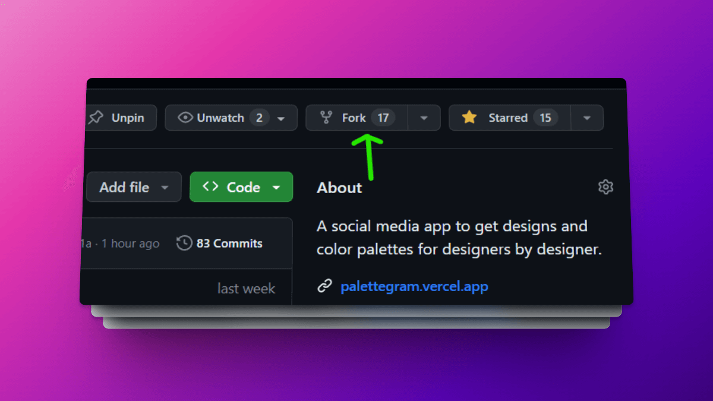

# Contribution to Palettegram

First of all, thank you for taking the time to contribute 😊.

We welcome contributions from anyone willing to improve this project or add new features.

Contribution guidelines are listed below. Please take the time to go through the guidelines and follow them so that it is easy for maintainers to merge or address your contributions.

## Table of Contents

- [Contributing to Palettegram 🪡](#contributing-to-Palettegram-)
  - [Table of Contents](#table-of-contents)
  - [First time Contributor](#first-time-contributor)
  - [I Want To Contribute](#i-want-to-contribute)
    - [Fork the Project](#fork-the-project)
    - [Create a new branch](#create-a-new-branch)
    - [Work on the issue assigned](#work-on-the-issue-assigned)
    - [Commit](#commit)
    - [Push Local Changes](#push-local-changes)
    - [Pull Request](#pull-request)
    - [Review](#review)
  - [Other Ways to Contribute](#other-ways-to-contribute)

## First time Contributor

To get an idea of the app, feel free to check out the website(to be added soon).

You can start with available list of [issues](https://github.com/Sanchitbajaj02/Palettegram/issues)

## I Want To Contribute

- Always check for [existing issues](https://github.com/Sanchitbajaj02/Palettegram/issues) before creating a new issue.
- Only start working on an issue if it has been assigned to you. This avoids multiple PRs for the same issue.
- Every change in this project must have an associated issue. **Issue before PR**


To start contributing to this project, follow the steps below.

### Fork the Project

- Star & Fork this repository. This will create a local copy of this repository on your github profile.



- Follow [git workflow](docs/git.md) to know more.

### Create a new branch

Creating a new branch lets you work on your issue without creating merge conflicts while making PRs.
Select a name for your branch that is in line with the issue you are addressing.

```bash
# It will create a new branch with name branch_name and switch to that branch
git checkout -b branch_name
```

### Work on the issue assigned

- Work on the issue assigned to you.
- Add all the files/folders needed.
- After you've made your contribution to the project add changes to the branch you've just created:

```bash
# To add all new files to branch branch_name
git add .

# To add only a few files to branch_name
git add <names of files changed or added>
```

### Commit

- To commit this changes, give a descriptive message for the convenience of reviewer. Follow the [commitlint](docs/commitlint.md) guidelines to know more.

```bash
# This message will be associated with all files you have changed
git commit -m "message"
```

### Push Local Changes

```bash
# To push your work/changes to your remote repository
git push -u origin branch_name
```

### Pull Request

Go to your repository in the browser and click on compare and pull requests.
This will send a request to the maintainer to add your contribution to the main repository i.e., `https://github.com/Sanchitbajaj02/Palettegram.git`

### Add a title to your Pull Request.

Add a meaningful title to the pull request so that reviewing will be easy for our team. Follow the [commitlint](docs/commitlint.md) guidelines to know more

```text
fix: minor issues to increase performance by 20%
```

Make sure to mention which issue is solved with this Pull Request by mentioning the issue number #. Then add a description to your Pull Request that explains your contribution.

### Review

Congratulations! 🎉🌟 Sit and relax, you've made your contribution to the Palettegram project. Wait until the PR is reviewed and incorporate changes suggested by the reviewers. After which the PR can be successfully merged.

## Other Ways to Contribute

If you like the project, but just don't have time to contribute, that's fine. There are other easy ways to support the project and show your appreciation, which we would also be very happy about.

- Star the project 
- Tweet about it 
- Mention this project to your peers
