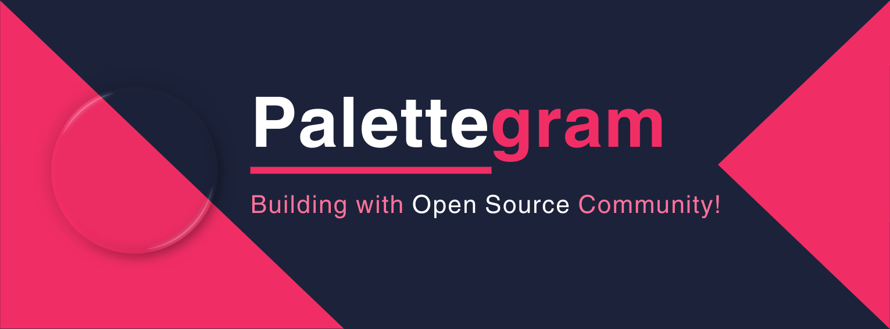
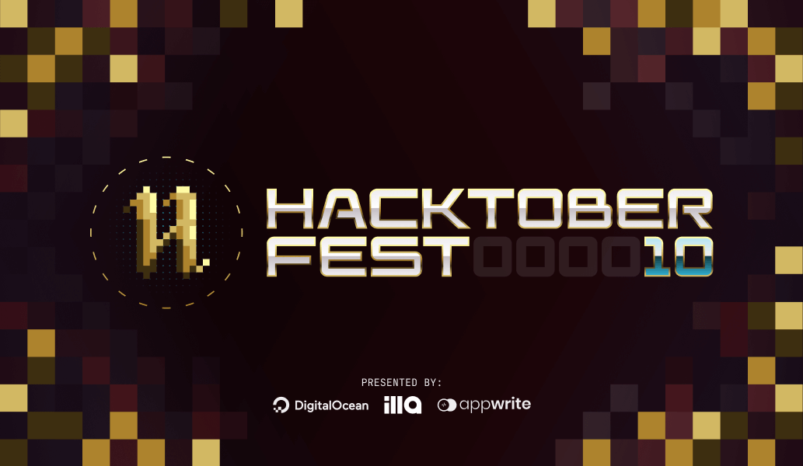
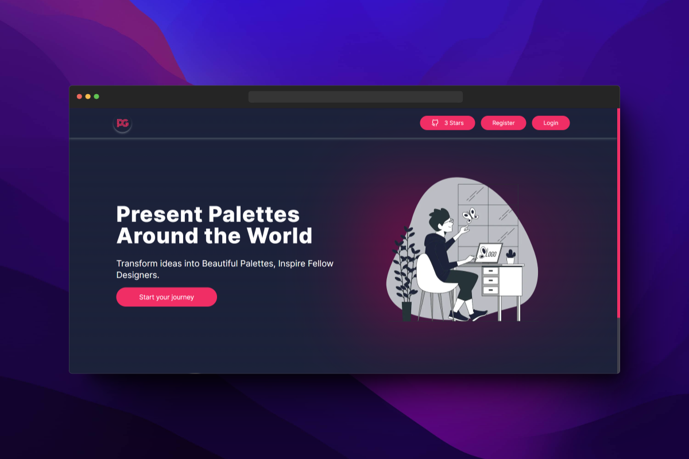

# Palettegram - social media for professionals

<!-- A web app to get designs inspirations and color palettes for professionals by professionals. -->

## ⚡ Project Status

<!--  -->

## 🏆 Featured in:

| Event Logo                                                                                                                    | Event Name         |
| ----------------------------------------------------------------------------------------------------------------------------- | ------------------ |
|  | Hacktoberfest 2023 |

<!--  -->

 

## 🤔 Why open source

Contributing in open source increases your opportunities to work with different projects and mentors, getting to know various insights and ideas. It is a platform where contributors grow together with a construvtive and a positive attitude.

This repository also provides one such platforms where contributers come over and put their ideas of new games and make our website as interactive as much they can!

<h5 align="center"><i>If you like the project, please <a href="https://github.com/Sanchitbajaj02/palettegram/stargazers">★</a> this repository to show your support! 🤩</i></h5>

## 🤝 Join Community

## 💻 Tech Stack

- [Next.js](https://nextjs.org) - Next.js is an open-source web development framework.
- [TypeScript](https://www.typescriptlang.org) - TypeScript is a free and open-source high-level programming language.
- [Tailwind CSS](https://tailwindcss.com) - Tailwind CSS is a utility-first CSS framework for rapidly building modern websites without ever leaving your HTML.
- [Appwrite](https://appwrite.io/) - Appwrite is an open-source backend platform for developing Web, Mobile, and Flutter applications.

## Live demo 💻

Visit https://palettegram.vercel.app to see the live demo!

## 👋 Introduction

Palettegram is a social media application dedicated to professionals like graphic designers, UI/UX designers, Developers, etc. to leverage UI designs, design ideas, UX approaches and color palettes.

This application provides a streamlined workflow for the users to find the best color palettes and design ideas for their use and contribute back to the community.

## 🔨 What does it do?

UI designers are always looking for new inspiration, and a social media platform specifically designed for them would be a great way to find it. This platform would allow designers to share their work, including color palettes, designs, and even code snippets. It would also provide a forum for designers to collaborate and get feedback on their work.

### Features

The platform would have a number of features that would make it valuable for UI designers, including:

- A user-friendly interface: The platform would be easy to use and navigate so that designers could focus on sharing their work and getting feedback.

- A variety of ways to share work: Designers would be able to share their work in a variety of ways, including by uploading images, creating projects, and writing blog posts.

- A community of designers: The platform would be an excellent way for designers to connect with other designers and get feedback on their work.

- A marketplace: The platform could also include a marketplace where designers could sell their work or hire other designers.

### Benefits

There are many benefits to a social media platform for UI designers, including:

- Increased exposure: The platform would give designers a way to get their work seen by a wider audience.

- Improved collaboration: The platform would provide a forum for designers to collaborate and get feedback on their work.

- New inspiration: The platform would be an excellent way for designers to find new inspiration for their work.

- Opportunities for growth: The platform could provide opportunities for designers to grow their businesses or find new jobs.

## 🛡️ License

Palettegram is licensed under the MIT License - see the [LICENSE](Licence) file for details.

## 🤔 How to contribute ?

Contributing to open-source software (OSS) projects can be a rewarding and fulfilling experience. Not only can you learn new skills, but you can also help make a valuable contribution to a project that benefits the broader community

- Remember to read [Code of Conduct](CODE_OF_CONDUCT.md) before contributing.

- Read the [Git Workflow](docs/git.md) to follow best practices.

- Follow the [Contribution Guidelines](CONTRIBUTING.md).

- Create an [issue](https://github.com/Sanchitbajaj02/palettegram/issues) to report bugs, and vulnerabilities or add a new feature.

- Remember to add a good commit message.

- Don't spam if you do it your PR/issue will be closed.

### Setup

- [Setting up a development environment](docs/setup.md)

- [Setting up Appwrite](docs/appwrite.md)

<!-- ## 💪🏽 Contributors

Thank you so much all for spending your time to improve Threadify. Keep shining ⭐

 -->

## 🙏🏽 Support

This project needs a star️ from you. Don't forget to leave a star 🌟
